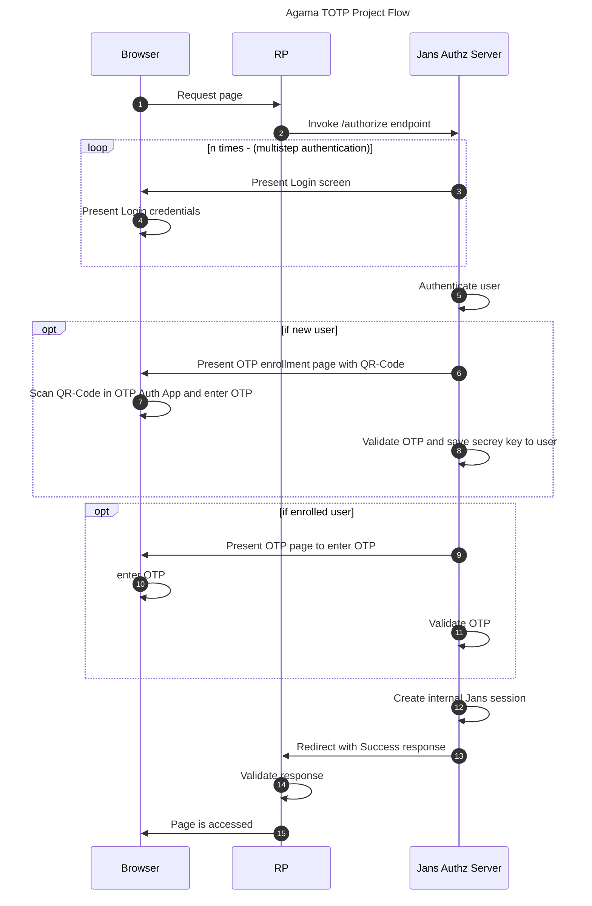

# Agama TOTP Project

Use this project to add user authentication with OTOP(Time-based One-time Passwords) 2-factor authentication.

## How it works at a glance

When then main flow of this project is launched (namely, `org.gluu.agama.totp.main`) it shows login page. User enters username and password. After user authn, OTP enrollmen page open for new user and if user is already enrolled then it will directly ask for OTP.

